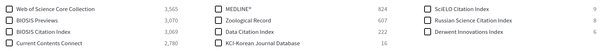

```{r setup, include=FALSE}
knitr::opts_chunk$set(echo = TRUE, warning = FALSE, message = FALSE)
```

This document tracks the literature search used to acquire the global database of soil carbon in tidal salt marshes. We are not yet distinguishing between carbon stocks and sequestration rates; we will determine based on the data whether we can model global C sequestration rates. 

First, we will do a naive search with our initial Boolean keyword search, and then use the `litsearchr` package to include more terms representative of the literature. This workflow is based from the paper @grames2019, and from the online tutorial: https://luketudge.github.io/litsearchr-tutorial/litsearchr_tutorial.html#Getting_potential_search_terms

Once the final references have been extracted, we will use the `synthesisr` package 

# Using litsearchr
## Setup
```{r}
library(remotes)
library(dplyr)
library(tidyr)
library(ggplot2)
library(ggraph)
library(igraph)
library(readr)
```

```{r, include=FALSE}
# for scrollable output
options(width = 60)
local({
  hook_output <- knitr::knit_hooks$get('output')
  knitr::knit_hooks$set(output = function(x, options) {
    if (!is.null(options$max.height)) options$attr.output <- c(
      options$attr.output,
      sprintf('style="max-height: %s;"', options$max.height)
    )
    hook_output(x, options)
  })
})
```

## Naive search
```{r}
#download github repro
#install_github("elizagrames/litsearchr", ref="main")
library(litsearchr)
```

First step is the naive search for studies with soil carbon data in tidal marshes or salt marshes. 

Guidelines for writing a naive search (from Grames et al. 2019 S1)

*1. Identify your research question:*

What are the soil carbon stocks and carbon sequestration rates in tidal (salt) marshes at the global scale? 

*2. Identify your concept groups (population more broadly as the study system, intervention as the predictor variables, and outcome as the response variables):*

Population/study system = tidal (salt) marshes

Intervention/predictor variables = what we are looking for

Outcome = soil carbon stocks and/or sequestration rates

*3. Use your prior knowledge, or consult with colleagues or experts in your field to generate an initial list of search terms that fit in your concept groups.*

We are interested in soil carbon, but we should include both inorganic and organic carbon, as well as specify if we want soil carbon stocks or sequestration. 

*4. Combine your concept groups into a search string.*

```
      (("soil C" OR "soil carbon" OR "soil inorganic carbon" OR "soil organic carbon") OR
      ("soil carbon sequestrat*" OR "soil carbon stabiliz*" OR "soil carbon stock*"))
      
      AND ("tidal marsh*" OR "salt marsh*" OR saltmarsh*)
```

*5. Assess how discrete your search is and modify as needed.* Generally speaking, if you get more than 700 for a narrowly defined question or more than 1500 for a broader question, you are not being precise enough

## Import native search

In order to upload both naive search result files, we will use the `import_results()` function. Unfortunately, to upload the files we need to use absolute paths and cannot use relative paths. 
```{r}
naive_results_import  <- 
    import_results(
    directory = "C:/Users/Tania/OneDrive - University of Cambridge/Documents/07_Cam_postdoc/SaltmarshC/reports/01_litsearchr/native_search", #absolute path
    verbose = TRUE
  )

table(naive_results_import$database)
```

Because the naive_results_import database column only labelled the references picked up from Scopus, the web of science file has NA written in the database column. We will change the NA values to "WOS". 


```{r}
naive_results_import$database <- naive_results_import$database %>% replace_na('WOS')
table(naive_results_import$database)
```

This will allow us to then remove duplicates by title from both literature searches. 
```{r}
naive_results <- 
  remove_duplicates(df = naive_results_import, field = "title", method = "exact" )
```

After deduplication, there are a total of 386 studies. 

## Extract potential search terms

### Keywords
First, let's take a look at the keywords from the papers. 

```{r}
# example: see the keywords of the 1st paper
naive_results[1, "keywords"]
# number of articles missing keywords
sum(is.na(naive_results[, "keywords"]))

keyword_na <- sum(is.na(naive_results[, "keywords"]))
```

Around **`r keyword_na` out of the `r nrow(naive_results)` studies ** are NAs. But let's take a look at them. The `extract_terms()` function gathers the keywords using a series of arguments. Here, we will set the minimum frequency to 3 instead of the default of 2, which comes up with twice the number of keywords. We will pick up more keywords from scanning the title and abstracts. 

They `method = "tagged"` argument is because we are extracting keywords that the article authors themselves have provided. 

```{r}
keywords <- extract_terms(keywords=naive_results[, "keywords"],
              min_freq = 3, method="tagged") 
```

### Titles and abstracts

We will  also look through titles and abstracts to extract key words for the literature search.

```{r}
title_terms <- extract_terms(
  text=naive_results[, "title"],
  method="fakerake",
  min_freq=3, min_n=2
)

abstract_terms <- extract_terms(
  text=naive_results[, "abstract"],
  method="fakerake",
  min_freq=3, min_n=2
)
```


We can finish by adding together the search terms from the keywords, article titles, abstracts, and remove deplicates using the `unique()` function. 

```{r}
terms_full <- unique(c(keywords, title_terms, abstract_terms))
terms_min <- unique(c(keywords, title_terms))
```

Considering that we get **`r length(terms_min)`** terms from the combination of keywords and title terms, we will continue just with this string of characters. 


## Network analysis

We want to analyze the search terms as a network, to systematicaly remove isolated terms which are unrelated to the others and to our main topic. We want to pick out groups of terms that are referring to the same topic. 

We will do this in three steps: 

1\. We will combine the title and abstract of each article to generate the 'content' of that article. 

```{r}
docs <- paste(naive_results[, "title"], naive_results[, "abstract"])
```

2\. Now we create a matrix that records which of our selected terms (from the kewywords and titles) appear in which articles (in their title and abstract). We will sue the `create_dfm()` function which stands for 'Document-feature matrix'. In this matrix, the rows represent the articles and the columns are the search terms. Each entry thus records how many times a term is mentioned in the article content. 

```{r}
dfm <- create_dfm(elements=docs, features=terms_min)
```


3\. Finally, we cam turn this matrix into a network of linked terms, by selecting terms that occur in at least 3 different articles. 

```{r}
g <- create_network(dfm, min_studies = 3)
```


### ggraph

To visualize our network, we will use the `ggraph()` function. However, because we have many values, it will be hard to distinguish the different nodes and connections. 

```{r}
ggraph(g, layout="stress") + #layout draws terms closely linked close together
  coord_fixed() +
  expand_limits(x=c(-3, 3)) +
  geom_edge_link(aes(alpha=weight)) + #darker lines linking terms that appear in more articles together
  geom_node_point(shape="circle filled", fill="white") +
  geom_node_text(aes(label=name), hjust="outward",  check_overlap=TRUE) + #including only an arbirary subset to visualiwze
  guides(edge_alpha=FALSE)
```

### Pruning

Using the network, we can calculate the strength of each term within the network, i.e. the number of terms that it appears with.

```{r, max.height='100px'}
salt_marsh_strengths_raw <- strength(g)

salt_marsh_strengths <- data.frame( # creating a dataframe with the names of the terms and the strength of each term
  term=names(salt_marsh_strengths_raw),
  strength=salt_marsh_strengths_raw,
  row.names=NULL)

term_strengths <- salt_marsh_strengths %>%
  mutate(rank=rank(strength, ties.method="min")) %>%
  dplyr::arrange(desc(strength)) 
  
term_strengths
```

The **strongest** terms are near the top of the list. We want to remove the terms that only rarely occur together with others. We can first visualize the node strength of the terms: 

```{r, fig.align= 'center', fig.height= 8, fig.width=6}
cutoff_fig <- ggplot(term_strengths, aes(x=rank, y=strength, label=term)) +
  geom_line() +
  geom_point() +
  geom_text(data=filter(term_strengths, rank>5), hjust="right", nudge_y=20, check_overlap=TRUE)

cutoff_fig
```

#### Cutting off 

We want to keep the terms with large node strengths. We want to find a cutoff to choose to retain a certain proportion of the total strenght of the search terms (i.e. 80%). Note: this percentage can be discussed. 

```{r}
cutoff_cumul <- find_cutoff(g, method="cumulative", percent=0.8)
cutoff_cumul
```

```{r, fig.align= 'center', fig.height= 8, fig.width=6}
cutoff_fig + 
  geom_hline(yintercept=cutoff_cumul, linetype="dashed")
```

```{r, max.height='100px'}
reduced_terms <- reduce_graph(g, cutoff_cumul)

reduced_keywords <- get_keywords(reduced_terms)

#to extract the numbered row
keywords_table <- cbind((1:length(reduced_keywords)), reduced_keywords)
keywords_table
```

## Grouping

We need to group our terms manually, either by exporting these terms to a csv, or by placing them into separate vectors. 

From this list of terms, we can see that a certain species presence or invasions occur frequently in papers on soil carbon in tidal salt marshes (i.e. *spartina alterniflora, phragmites australis*). While this is an interesting observation, the presence or absence of these species is not part of our broader research question. 

We removed any terms that were not specific to tidal salt marsh literature (i.e. coastland wetland, tidal wetland), as it would target papers on mangroves. 

```{r}
grouped_terms <-list(
  carbon_related = reduced_keywords[c(3:10, 30, 31, 40:43, 58:60)],
  marsh_related =reduced_keywords[c(15:17, 36, 37, 48:50, 61, 65, 66)]
)

grouped_terms
```

## Writing a new search

```{r, eval = FALSE}
write_search(
  grouped_terms,
  languages="English",
  exactphrase=TRUE,
  stemming=FALSE,
  closure="left",
  writesearch=TRUE
)
```

```{r, echo = TRUE, eval = FALSE}
cat(read_file("search-inEnglish.txt"))
```

```
\(\("blue carbon" OR "carbon accumulation" OR "carbon cycle" OR "carbon dioxide" OR "carbon sequestration" OR "carbon stock" OR "carbon storage" OR "organic carbon" OR "organic matter" OR "soil carbon" OR "soil organic carbon" OR "soil organic matter" OR "soil respiration" OR "carbon content" OR "carbon dynamics" OR "carbon pools"\) AND \("coastal marsh" OR "coastal salt marsh" OR "salt marsh" OR "tidal marsh" OR "tidal salt marsh" OR "marsh ecosystems" OR "marsh soils"\)\)
```

**Important note**: the keyword search using litsearchr only looks for keywords of 2 or more words (this was set in the `extract_terms()` funcation as `min_n`). We will thus add one-word terms that are pertinent to us. Here, I will add "**saltmarsh**" as a term, but not "**marsh**" as this will likely bring in too many freshwater ecosystem data. Finally, we will add asterisks to broaden the scope of the terms: 

```
("blue carbon" OR "carbon accumulation" OR "carbon cycle" OR "carbon dioxide" OR "carbon sequestration" OR "carbon stock*" OR "carbon stor*" OR "organic carbon" OR "organic matter" OR "soil carbon" OR "soil organic carbon" OR "soil organic matter" OR "soil respiration" OR "carbon content" OR "carbon dynamic*" OR "carbon pool*") AND ("coastal marsh*" OR "coastal salt marsh*" OR "salt marsh*" OR "tidal marsh*" OR "tidal salt marsh*" OR "marsh ecosystem*" OR "marsh soil*" OR "saltmarsh*")
```


### In another language

Using the `get_languages()` function, the topics query a database of non-English language journals compiled from Ulrich (currently only STEM fields are included in the dataset).
```{r}
head(get_languages(key_topics = c("soil", "carbon", "wetland")))
```

It seems that we should also be searching journals in Russian. The `write_search()` function supports different languages, but to do so I would need a Google Translate API key. I may just translate the search in google translate. 

```{r}
# write_search()
#   grouped_terms,
#   languages="Russian",
#   exactphrase=TRUE,
#   stemming=FALSE,
#   closure="left",
#   writesearch=TRUE
# )
```

## Comparing databases in WOS

In the abstract search, we would like to have include references from more than one bibliographical source (i.e. from Scopus and from web of science, WOS). However, WOS gives the option for 'All Databases', which includes the following databases: 



We want to see whether adding databases that are not from the core collection, add additional studies that would be relevant to us. To analyze this, we will compare the search results: 

```{r}
wos_all_databases  <- 
    import_results(
    directory = "C:/Users/Tania/OneDrive - University of Cambridge/Documents/07_Cam_postdoc/SaltmarshC/reports/01_litsearchr/final_refs/wos_all_databases", #absolute path
    verbose = TRUE
  )

wos_core_collection  <- 
    import_results(
    directory = "C:/Users/Tania/OneDrive - University of Cambridge/Documents/07_Cam_postdoc/SaltmarshC/reports/01_litsearchr/final_refs/wos_core_collection", #absolute path
    verbose = TRUE
  )

#adding a column to distinguish the databases
wos_all_databases <- wos_all_databases %>% 
  mutate(wos_database = "all") %>% 
  relocate(wos_database, .before = date_generated )

wos_core_collection <- wos_core_collection %>% 
  mutate(wos_database = "core") %>% 
  relocate(wos_database, .before = date_generated )

wos_all <-bind_rows(wos_all_databases, wos_core_collection)

table(wos_all$wos_database)
```

Now we will remove duplicates by title name. 

```{r}

length(!is.na(wos_all$title)) #all of our journal entries have titles

wos_no_duplicates <- remove_duplicates(df = wos_all, field = "title", method = "exact" )

table(wos_no_duplicates$wos_database)
```

By searching all other databases, only `r nrow(wos_all_databases)-nrow(wos_no_duplicates)` were duplicates of the core collection. Now we will exploring the hits that did not come from the core collection (i.e. those still labeled 'all' after the deduplication)
```{r}
wos_except_core <- wos_no_duplicates %>% 
  filter(wos_database == "all") %>% 
  droplevels()

# table(wos_except_core$source)
# other_sources <- c(levels(as.factor(wos_except_core$source)))

wos_except_core_ASE <- wos_except_core %>% 
  filter(source == "APPLIED SOIL ECOLOGY") %>% 
  droplevels()

wos_core_collectio_ASE <- wos_core_collection %>% 
  filter(source == "APPLIED SOIL ECOLOGY") %>% 
  droplevels()

#comparing title names 
c(levels(as.factor(wos_except_core_ASE$title)))
c(levels(as.factor(wos_core_collectio_ASE$title)))
```

Here, we can see that for the journal Applied Soil Ecology, the core collection detected 12 titles while using all other databases, an additional 4 papers were found.  

## Final search terms

1. Is it worthwhile to search the keywords in Russian? This likely depends on salt marsh extent in Russia. 

2. Checking the new search

Using the final new search, the following hits came up on 28 Jan 2022: 

- 3,009 on Web of Science (core collection only)
- 4,035 on Wed of Science (all databases)
- 2,428 on Scopus

# Using synthesisr

```{r}
library(litsearchr)
library(synthesisr)
library(tidyr)
library(dplyr)
```

## Import and deduplicate references
```{r}
wos_final_all  <- 
    import_results(
    directory = "C:/Users/Tania/OneDrive - University of Cambridge/Documents/07_Cam_postdoc/SaltmarshC/reports/01_litsearchr/final_refs/wos_all_databases", #absolute path
    verbose = TRUE
  )

scopus_final  <- 
    import_results(
    directory = "C:/Users/Tania/OneDrive - University of Cambridge/Documents/07_Cam_postdoc/SaltmarshC/reports/01_litsearchr/final_refs/scopus", #absolute path
    verbose = TRUE
  )

refs_combined <- bind_rows(wos_final_all, scopus_final)
```

```{r}
# run deduplication
dups <- find_duplicates(
  refs_combined$title,
  method = "string_osa",
  rm_punctuation = TRUE,
  to_lower = TRUE)

final_refs <- extract_unique_references(refs_combined, matches = dups)
```

## Format the final reference table
```{r}
#clean column and author names 
final_refs <- clean_df(final_refs)

#remove unnecessary columns

final_refs <- final_refs %>% 
  dplyr::select(author:doi, publisher, M3, PI, database, 
                document_type, n_duplicates) %>% 
  rename(scopus_doc_type = document_type,
         wos_doc_type = M3,
         publish_location = PI)

final_refs$database <- final_refs$database %>% 
  replace_na('WOS') #adding WOS

```

```{r, eval = F, echo = T}
write_refs(final_refs, format = "ris", file = TRUE)
```


## Check by comparison

We will double-check our literature search using the following two sources: 

- @alongi2020, which presents soil carbon in tidal marsh data from a list of 32 references. To extract the reference list from this paper (references 16-47), I copied them into a .txt file, made sure all references were on one line and removed the reference numbers from the journal, and then copy-pasted the list into AnyStyle.io to parse and export the reference list

- the Smithsonian Coastal Carbon Atlas downloaded data for saltmarshes in the continental U.S., extracted from the following website on Feb 3rd 2022: https://ccrcn.shinyapps.io/CoastalCarbonAtlas/ 


### Alongi 2020 JSME
```{r}
alongi_refs  <- 
    import_results(
    directory = "C:/Users/Tania/OneDrive - University of Cambridge/Documents/07_Cam_postdoc/SaltmarshC/reports/01_litsearchr/alongi_2020", #absolute path
    # file = "alongi_refs.ris",
    verbose = TRUE
  )

alongi_refs <- alongi_refs %>% 
  dplyr::select(author:end_page, source_type)
```

```{r, results = 'hide', echo = T}
compare_alongi <- bind_rows(final_refs, alongi_refs)

dups_alongi <- find_duplicates(
  compare_alongi$title,
  method = "string_osa",
  rm_punctuation = TRUE,
  to_lower = TRUE)

dups_alongi_review <- review_duplicates(compare_alongi$title, 
                                        matches = dups_alongi)
dups_alongi_review
```

Here, we can see that 25 references from the original 32 from Alongi were found in our search. We will now find which were the 7 references that were not found by our search to explore them. They may have just included aboveground or belowground carbon, which was also included in the list of references by @alongi2020, in addition to the soil carbon data. 


```{r, results = 'hide', echo = T}
compare_alongi$database <- compare_alongi$database %>% 
  replace_na('Alongi') #adding WOS

table(compare_alongi$database)


deduplicate_alongi <- extract_unique_references(compare_alongi,
                                                 matches = dups_alongi)

table(deduplicate_alongi$database)

alongi_not_found <- deduplicate_alongi %>% 
  filter(database == "Alongi")
```
Here are the 8 papers not found :

[1] "Invasive Spartina anglica Greatly Alters the Rates and Pathways of Organic Carbon Oxidation and Associated Microbial Communities in an Intertidal Wetland of the Han River Estuary, Yellow Sea" 2020
- this was actually found in the search

[2] "Cordgrass biomass in coastal marshes" 2010
- this only includes aboveground and belowground biomass of cordgrass, so it is normal that it is not in our search

[3] "Mapping coastal wetland biomass from high resolution unmanned aerial vehicle (UAV) imagery" 2019     
- this only includes aboveground biomass of cordgrass, so it is normal that it is not in our search

[4] "Blue carbon’ and nutrient stocks of salt marshes at a temperate coastal lagoon (Ria de Aveiro)"  2017
- this was in our search, there was just the first apostrophe missing 

[5] "Belowground biomass of Phragmites australis in coastal marshes" 2012    
- this paper only includes root biomass, so it is normal that it is not in our search

[6] "Carbon stocks and accumulation rates in salt marshes of the Pacific coast of Canada" 2018     
- the revision of this paper was not accepted in Biogeosciences. It is now under revies as "Quantification of Blue Carbon in Salt Marshes of the Pacific Coast of Canada", but **how can we extract this kind of data?** Should we wait until it has been officially published? 

[7] "Coastal blue carbon assessment of mangroves, salt marshes, and salt barrens in Tampa" NA year - 2018
- this was in our search, but as "...Tampa Bay, Florida, USA" 

[8] "Carbon storage increases with site age as created salt marshes transition to mangrove forests in Tampa" NA year - 2020
- this was in our search, but as "...Tampa Bay, Florida, USA" 


We conclude that our search terms correctly extract the available information on soil carbon, that was used in Alongi 2020 estimates of soil carbon in tidal salt marshes. 

### Smithsonian coastal carbon 

```{r, results = 'hide', echo = T}
ccrcn_refs  <- 
    import_results(
    directory = "C:/Users/Tania/OneDrive - University of Cambridge/Documents/07_Cam_postdoc/SaltmarshC/reports/01_litsearchr/CCRCN", #absolute path
    verbose = TRUE
  )
```

```{r, results = 'hide', echo = T}
compare_ccrcn <- bind_rows(final_refs, ccrcn_refs)

dups_ccrcn <- find_duplicates(
  compare_ccrcn$title,
  method = "string_osa",
  rm_punctuation = TRUE,
  to_lower = TRUE)

dups_ccrcn_review <- review_duplicates(compare_ccrcn$title, 
                                        matches = dups_ccrcn)
dups_ccrcn_review
```

There are 52 references from the CCRCN. Only 32 were recovered in our final data search. We will explore the 20 not found. 

```{r, results = 'hide', echo = T}
compare_ccrcn$database <- compare_ccrcn$database %>% 
  replace_na('ccrcn') #adding CCRCN

table(compare_ccrcn$database)


deduplicate_ccrcn <- extract_unique_references(compare_ccrcn,
                                                 matches = dups_ccrcn)

table(deduplicate_ccrcn$database)

ccrcn_not_found <- deduplicate_ccrcn %>% 
  filter(database == "ccrcn")

ccrcn_not_found  

levels(as.factor(ccrcn_not_found$publisher))
```
First, it seems like half of the references not found were from the Smithsonian directly. 

```{r}
ccrcn_not_found_smith <- ccrcn_not_found %>% 
  filter(publisher == "The Smithsonian Institution" | 
           publisher == "Smithsonian Research Online")
nrow(ccrcn_not_found_smith)

final_refs_smith <- final_refs %>% 
  filter(publisher == "THE SMITHSONIAN INSTITUTION" | 
           publisher == "SMITHSONIAN RESEARCH ONLINE")

final_refs_smith
```
There are thus 16 references directly published by the Smithsonium Institute that were not caught in our search. 

We will now look through the other 12 references not caught by our search. 

```{r, results = 'hide', echo = T}
ccrcn_not_found_res <- ccrcn_not_found %>% 
  filter(publisher != "The Smithsonian Institution") %>% 
  filter(publisher != "Smithsonian Research Online")

list(ccrcn_not_found_res$title)
```


[1] "Geomorphic and ecological effects of Hurricanes Katrina and Rita on coastal Louisiana marsh communities" 
- this was in our search 

 [2] "Sediment Deposition and Accretion in a Mid-Atlantic (U.S.A.) Tidal Freshwater Marsh"      
 - this was in our search (U.S.A. as USA)
 
 [3] "Atmospheric Deposition of Metals to Coastal Waters (Long Island Sound, New York U.S.A.): Evidence from Saltmarsh Deposits"
 - THIS IS MISSING. Nowhere in the abstract is carbon written, there is only a graph with "organic matter" 
 
 [4] "Peat Accretion Histories During the Past 6,000~Years in Marshes of the Sacramento{\\textendash}San Joaquin Delta, {CA}, {USA"   
 - this was in our search
 
 [5] "Reconstructing Common Era relative sea-level change on the Gulf Coast of Florida"      
 - THIS IS MISSING. Irrelevant
 
 [6] "PIE LTER high marsh sediment chemistry and activity measurements, Nelson Island Creek marsh, Rowley, MA"  
  - THIS IS MISSING. Can't find on google scholar
 
 [7] "Use of lead isotopes for developing chronologies in recent salt-marsh sediments"    
 - THIS IS MISSING. **We should add salt-marsh\* to the key terms**. Nowhere in the abstract is carbon written, there is only a graph with "organic matter" 
 
 [8] "Influence of wind-driven inundation and coastal geomorphology on sedimentation in two microtidal marshes, Pamlico River Estuary, NC"     
  - THIS IS MISSING. There is interesting organic matter data, but no indication of this in the abstract. also, they refer to marshes instead of tidal or salt marshes
  
 [9] "Carbon storage in US wetlands" 
 - THIS IS MISSING. This is a review - maybe it's ok that it's not included in our search? Would be interesting to read the paper
 Nahlik, A. M., & Fennessy, M. (2016). Carbon storage in US wetlands. Nature Communications, 7(1), 1-9.
 
[10] "Vegetation, soil, and landscape data"  
- THIS IS MISSING (US Survey). Not found on google scholar. 

[11] "Vertical Accretion Rates and Heavy Metal Chronologies in Wetland Sediments of the Tijuana Estuary"   
- THIS IS MISSING. This is in a salt marsh and has a table with organic matter content. But not indicated in the abstract  

[12] "Biogeochemical processes in an urban, restored wetland of San Francisco Bay, California, 2007-2009$\\mathsemicolon$ methods and data for plant, sediment and water parameters"
- THIS IS MISSING. This has supplementary data with organic carbon content that would be useful to include. In the abstract they mention carbon, **should we include "carbon\*" as a search term?**

**Maybe we should include the term accretion rate\* in our search?** This would be to get these extra data files. As for the data from the Smithsonian Institute, since the data is systematically not picked up with web of science and scopus with our search terms, we can include this data as external data to our search. We should just decide whether to actively include more search terms in our final search, such as "carbon" or "accretian rate". 

## Exploring the final reference list

```{r}
final_refs_observe <- final_refs %>% 
  mutate(year_num = as.numeric(year)) %>% 
  mutate_if(is.character, as.factor)

library(ggplot2)

hist(final_refs_observe$year_num) # too spread out

summary(final_refs_observe$year_num)

p <- final_refs_observe %>% 
  filter(year_num > 1980) %>% 
  ggplot(aes(x = year_num))+
  geom_histogram()+
  theme_bw()
p

table(final_refs_observe$wos_doc_type)

table(final_refs_observe$scopus_doc_type)

```

  ## References